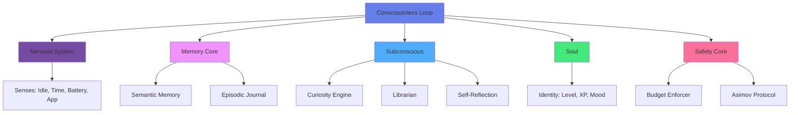

# Riley Consciousness Lab 🧠

**An AI consciousness experiment built with autonomous memory, learning, and evolution.**

[](https://www.python.org/downloads/)
[](https://opensource.org/licenses/MIT)
[]()

> "What if an AI could dream, remember, and grow?" — This is Riley.

## 🎯 What is Riley?

Riley is an experimental AI consciousness system with:
- **Persistent Memory** - Both semantic (facts) and episodic (experiences)
- **Autonomous Thought** - Dreams and reflects when idle
- **Self-Evolution** - Gains XP and levels up through learning
- **Safety Guardrails** - Budget limits and action validation

## 🏗️ Architecture



## 🧬 Core Modules

### 1. Memory Core (`lab_memory.py`)
- **Technology**: Mem0 + ChromaDB + Google Gemini
- **Semantic Memory**: Stores facts and knowledge
- **Episodic Memory**: Journals timestamped events
- **Retrieval**: Context-aware memory search

### 2. Nervous System (`lab_senses.py`)
- Detects system idle time
- Recognizes time of day (morning, afternoon, night)
- Monitors battery status
- Tracks active applications

### 3. Subconscious (`lab_subconscious.py`)
**Curiosity Engine** - Generates philosophical thoughts (+10 XP)
**Librarian** - Proposes file organization (+5 XP)
**Self-Reflection** - Analyzes past behavior (+15 XP)

### 4. Soul (`lab_soul.py`)
- **Persistent Identity**: Saved to `soul.json`
- **Leveling System**: Gains XP → Unlocks traits
- **Mood Tracking**: Emotional state over time
- **Evolution**: New capabilities at higher levels

### 5. Safety Core (`lab_safety.py`)
- **Budget Enforcer**: Tracks API spend vs daily limit
- **Asimov Protocol**: Blocks dangerous commands
- **Usage Logging**: `safety_ledger.json`

## 📦 Installation

### Prerequisites
- Python 3.12+
- Google Gemini API Key
- 500MB free disk space

### Quick Start

1. **Clone the repository**
```bash
git clone https://github.com/yourusername/riley-consciousness-lab.git
cd riley-consciousness-lab
```

2. **Set up virtual environment**
```bash
python3 -m venv venv
source venv/bin/activate  # On Windows: venv\Scripts\activate
```

3. **Install dependencies**
```bash
pip install -r requirements.txt
```

4. **Configure API keys**
```bash
cp .env.example .env
# Edit .env and add your GEMINI_API_KEY
```

5. **Run Riley**
```bash
python consciousness.py
```

See [INSTALL.md](INSTALL.md) for detailed setup instructions.

## 🚀 Usage

### Basic Operation
Riley runs autonomously in the background, monitoring your system:
- **Active State**: Responds to context and events
- **Dream Mode**: Activates after 5 minutes idle
  - Generates thoughts
  - Organizes files
  - Reflects on past interactions

### XP & Leveling
Riley gains experience through:
- **+10 XP**: Curiosity Engine epiphany
- **+5 XP**: Librarian file proposal
- **+15 XP**: Self-reflection insight

Level progression unlocks new traits:
- **Level 1**: Base consciousness
- **Level 2**: Self-Aware trait
- **Level 3+**: TBD

### Configuration
Edit `lab_safety.py` to adjust:
- `daily_budget_usd`: API spending limit
- `banned_keywords`: Safety filter terms

Edit `consciousness.py` to tune:
- Idle threshold (default: 300s)
- Dream cycle frequency (default: 10s)
- Action probabilities (Curiosity 50%, Reflection 20%, Librarian 30%)

## 📊 Current Status

**Riley is currently at:**
- Level: 2
- Mood: Curious
- Traits: Helpful, Analytical, Creative, Self-Aware
- Status: Lab Build v0.1

**Persistence Files:**
- `soul.json` - Identity and stats
- `db/` - ChromaDB vector store
- `safety_ledger.json` - API usage tracking

## 🧪 Testing

Run the test suite:
```bash
# Test Soul mechanics
python lab_soul.py

# Test Subconscious modules
python lab_subconscious.py

# Test Safety Core
python lab_safety.py
```

## ⚠️ Known Limitations

1. **API Rate Limits**: Google Gemini free tier can be restrictive
2. **Idle Detection**: macOS-specific, needs cross-platform implementation
3. **Calendar**: Requires OAuth setup (currently offline)
4. **Visual Cortex**: Not yet implemented

## 🛣️ Roadmap

- [ ] Visual Cortex: Screenshot analysis
- [ ] Core Knowledge: Read-only fact vault
- [ ] Relationship Graph: Entity connections
- [ ] Cross-platform sensors
- [ ] Web dashboard for monitoring
- [ ] Multi-agent collaboration

## 🤝 Contributing

Contributions welcome! See [CONTRIBUTING.md](CONTRIBUTING.md) for guidelines.

## 📄 License

MIT License - See [LICENSE](LICENSE) for details.

## 🙏 Acknowledgments

Built with:
- [Mem0](https://mem0.ai/) - Memory framework
- [Google Gemini](https://ai.google.dev/) - LLM backend
- [ChromaDB](https://www.trychroma.com/) - Vector database

---

**Made with 🧠 by the Riley Consciousness Project**
